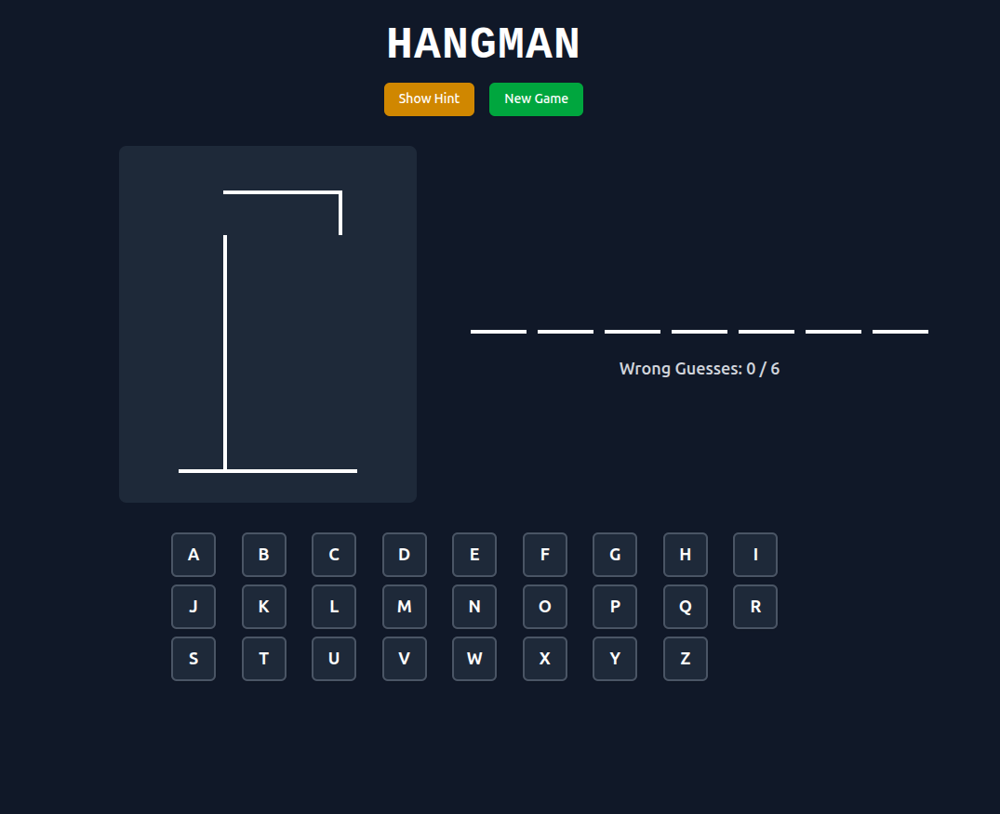

# Hangman Game

A modern, interactive Hangman game built with React, TypeScript, and Tailwind CSS. Features a dark chalkboard aesthetic reminiscent of classic classroom games.



## Features

- **Classic Hangman Gameplay** - Guess the word letter by letter before the drawing is complete
- **Dark Chalkboard Theme** - Authentic chalk-on-blackboard visual design
- **Interactive Keyboard** - Click buttons or use your physical keyboard to guess
- **Hint System** - Get helpful hints for each word
- **Win/Lose Modals** - Celebratory win screen and encouraging game over screen
- **Start Screen** - Welcome page with game instructions
- **Responsive Design** - Works perfectly on desktop, tablet, and mobile devices
- **Word Library** - 20+ words with hints across various categories
- **Visual Feedback** - Color-coded keyboard for correct/incorrect guesses
- **Smooth Animations** - Polished transitions and hover effects

## Quick Start

### Prerequisites

- Node.js (v14 or higher)
- npm or yarn package manager

### Installation

1. **Clone the repository**
   ```bash
   git clone https://github.com/abdullah@123/hangman-game.git
   cd hangman-game
   ```

2. **Install dependencies**
   ```bash
   npm install
   # or
   yarn install
   ```

3. **Start the development server**
   ```bash
   npm run dev
   # or
   yarn dev
   ```

4. **Open your browser**
   Navigate to `http://localhost:5173` to play the game!

## How to Play

1. **Start the Game** - Click "Start Game" on the welcome screen
2. **Guess Letters** - Click on keyboard buttons or use your physical keyboard
3. **Watch the Drawing** - Each wrong guess adds a body part to the gallows
4. **Use Hints** - Click "Show Hint" if you need help with the word
5. **Win or Lose** - Guess the word before the drawing is complete to win!
6. **Play Again** - Start a new game with a different word

## Built With

- **[React](https://reactjs.org/)** - Frontend framework
- **[TypeScript](https://www.typescriptlang.org/)** - Type safety and better development experience
- **[Tailwind CSS](https://tailwindcss.com/)** - Utility-first CSS framework
- **[shadcn/ui](https://ui.shadcn.com/)** - UI component library
- **[Vite](https://vitejs.dev/)** - Build tool and development server

## Design Features

### Visual Theme
- **Dark Mode Design** - Easy on the eyes with a sophisticated look
- **Chalkboard Aesthetic** - White chalk-style drawings on dark background
- **Monospace Typography** - Classic typewriter font for authentic feel
- **Responsive Layout** - Adapts beautifully to any screen size

### User Experience
- **Smooth Animations** - Fade-in effects and hover animations
- **Visual Feedback** - Color-coded buttons (green for correct, red for wrong)
- **Keyboard Support** - Full keyboard navigation support
- **Accessibility** - Proper contrast ratios and semantic HTML

## Customization

### Adding New Words

Edit `src/data/wordList.ts` to add new words:

```typescript
export const WORD_LIST: WordItem[] = [
  { word: "EXAMPLE", hint: "A sample or illustration" },
  // Add your words here
];
```

### Styling Customization

Modify `src/styles/hangman.css` to customize:
- Colors and themes
- Animations and transitions
- Layout and spacing
- Typography

### Game Rules

Adjust game settings in `App.tsx`:
- Maximum wrong guesses (default: 6)
- Keyboard layout
- Win/lose conditions

## Browser Support

- Chrome (recommended)
- Firefox
- Safari
- Edge
- Mobile browsers

## Contributing

Contributions are welcome! Here's how you can help:

1. **Fork the repository**
2. **Create a feature branch** (`git checkout -b feature/AmazingFeature`)
3. **Commit your changes** (`git commit -m 'Add some AmazingFeature'`)
4. **Push to the branch** (`git push origin feature/AmazingFeature`)
5. **Open a Pull Request**

### Ideas for Contributions

- Add sound effects and background music
- Implement multiple language support
- Add score tracking and statistics
- Create additional themes (neon, retro, etc.)
- Add difficulty levels
- Improve mobile experience
- ♿ Enhance accessibility features

## License

## Acknowledgments

- Inspired by classic Hangman games
- Built with modern web technologies
- Designed for educational and entertainment purposes
